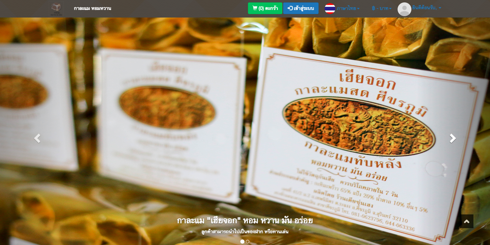
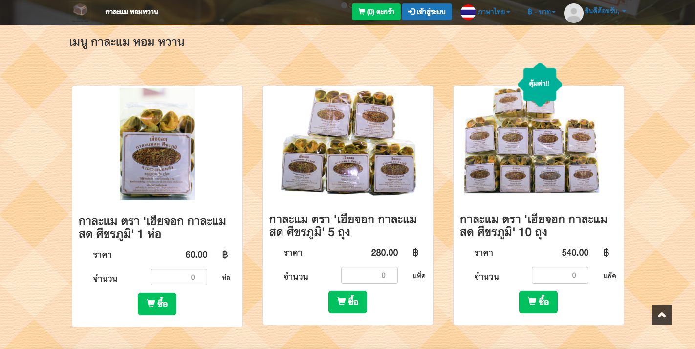
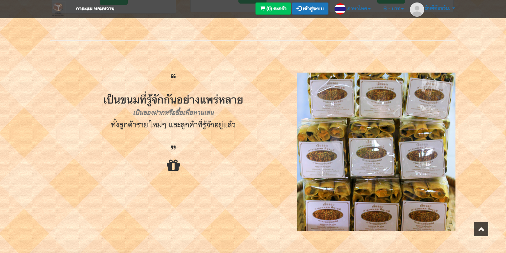
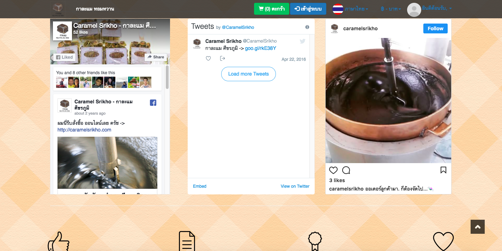

# Caramel Srikho 

  

  

  

  

  

  

# cskweb

This project is generated with [yo angular generator](https://github.com/yeoman/generator-angular)
version 0.14.0.

## Build & development

Run `grunt` for building and `grunt serve` for preview.

## Testing

Running `grunt test` will run the unit tests with karma.
